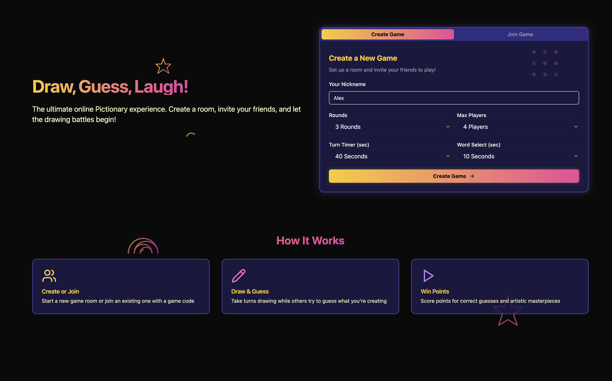
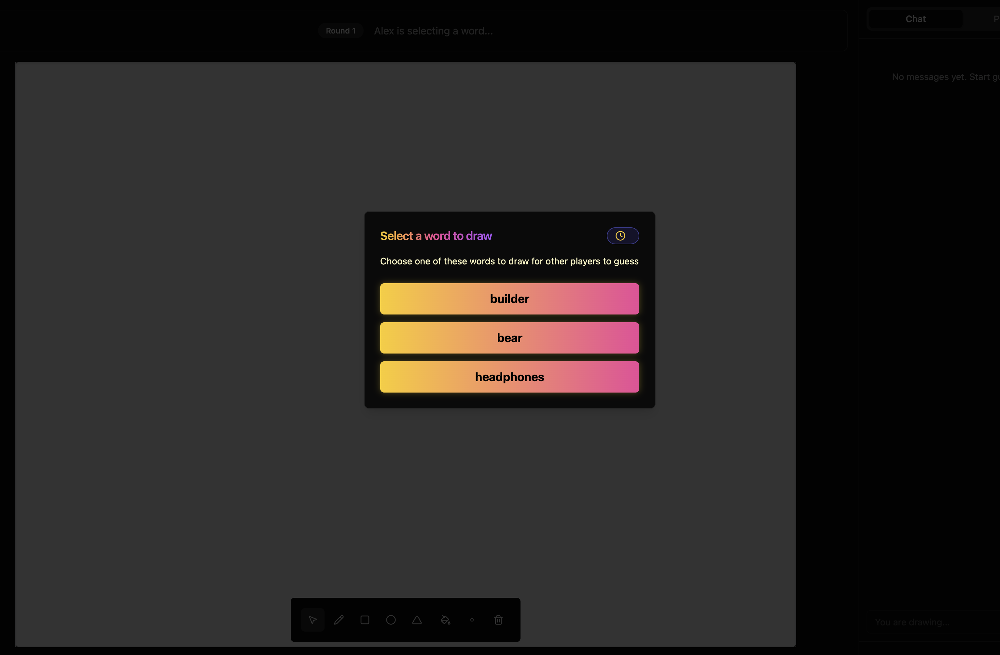
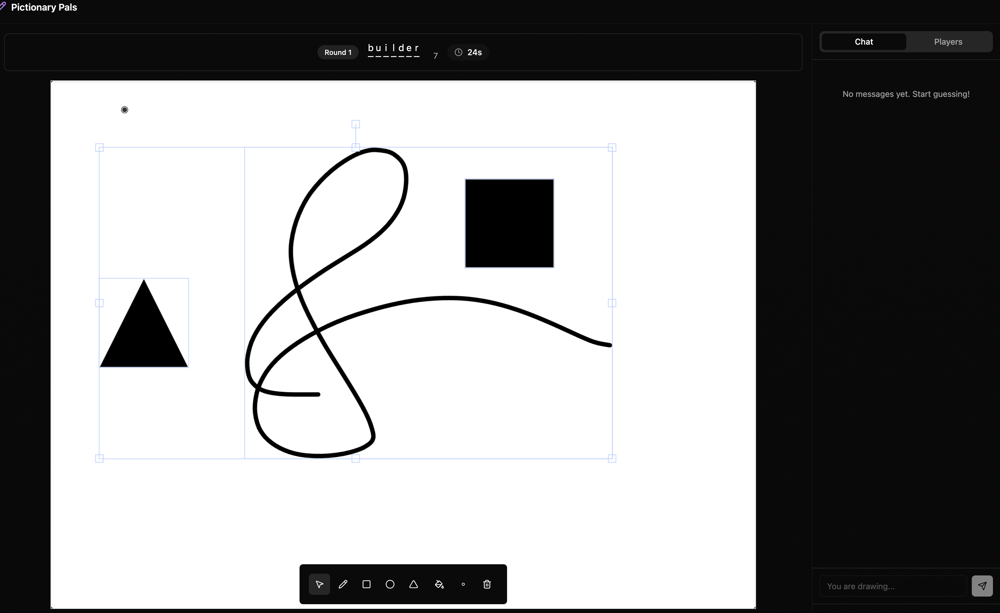

# Pictionary Multiplayer Game

A real-time multiplayer drawing and guessing game inspired by the classic Pictionary. Players take turns drawing a randomly selected word while others try to guess it before time runs out.

## Screenshots

### Landing Page


### Word Selection


### Active Drawing Turn


## Tech Stack

### Frontend
- **React** - UI framework
- **TypeScript** - Type-safe JavaScript
- **Fabric.js** - Canvas manipulation library
- **TailwindCSS** - Utility-first CSS framework
- **Framer Motion** - Animations
- **React Router** - Navigation
- **Websockets** - Real-time communication

### Backend
- **Go** - Server-side language
- **Echo** - Web framework
- **Gorilla Websocket** - WebSocket implementation
- **Context** - For cancellation and cleanup
- **Mutex** - For thread-safe game state management

## Key Features

- 🖌️ **Real-time drawing** with synchronized canvas across all players
- 🔄 **Undo/redo functionality** with WebSocket synchronization
- 👥 **Player management** with reconnection grace period
- ⏱️ **Timer system** for game rounds, word selection, and turns
- 🎮 **Game state management** with proper cleanup and lifecycle
- 📱 **Responsive design** with 4:3 drawing canvas ratio
- 🎨 **Drawing tools** including pencil, shapes, and colors

## Project Structure

```
pictionary/
├── frontend/           # React frontend application
│   ├── src/
│   │   ├── components/ # UI components
│   │   ├── hooks/      # Custom React hooks
│   │   ├── pages/      # Main page components
│   │   ├── types/      # TypeScript type definitions
│   │   └── utils/      # Utility functions
├── mobile/             # Mobile application (early development)
│   ├── components/     # Mobile UI components
│   ├── hooks/          # Mobile-specific hooks
│   ├── screens/        # Mobile screens
│   └── types/          # Mobile type definitions 
└── backend/            # Go backend server
    ├── cmd/            # Application entry points
    ├── internal/       # Internal packages
    │   ├── game/       # Game logic
    │   ├── handlers/   # HTTP handlers
    │   ├── messaging/  # WebSocket messaging
    │   ├── server/     # Server setup
    │   └── ws/         # WebSocket implementation
    └── scripts/        # Utility scripts
```


### Prerequisites
- Node.js 16+ for frontend
- Go 1.20+ for backend

### Running the Frontend
```bash
cd frontend
npm install
npm run dev
```

### Running the Backend
```bash
cd backend
go run cmd/server/main.go
```

## Current Status & Roadmap

### Completed
- Core game mechanics (drawing, guessing, turn rotation)
- Real-time synchronization of drawing canvas
- Player management with reconnection handling
- Basic game loop (lobby, word selection, drawing, scoring)
- Canvas tools (pencil, shapes, colors)
- Responsive UI design

### In Progress
- Letter reveal logic
- Authentication system
- Improved word selection and categories
- Spectator mode
- Game statistics and leaderboards
- Mobile version (early development stage)

### Future Plans
- Custom word lists and room settings
- Voice chat integration
- Mobile-optimized interface
- Better diffing for game state updates

## Mobile Version

The mobile version of the game is currently in the early stages of development. It aims to provide a native-like experience for iOS and Android users while sharing core logic with the web version. Currently, basic functionality is being implemented with a focus on responsive design and touch interactions.

## Architecture Highlights

### Frontend
- **Custom hooks** for canvas management, WebSocket communication, game state
- **Component-based design** with separation of concerns
- **Responsive layout** that maintains drawing aspect ratio

### Backend
- **Concurrent game sessions** with proper resource cleanup
- **Event-driven architecture** for game state transitions
- **Connection management** with graceful reconnection handling
- **Context-based cancellation** for clean shutdown

## License

MIT License 